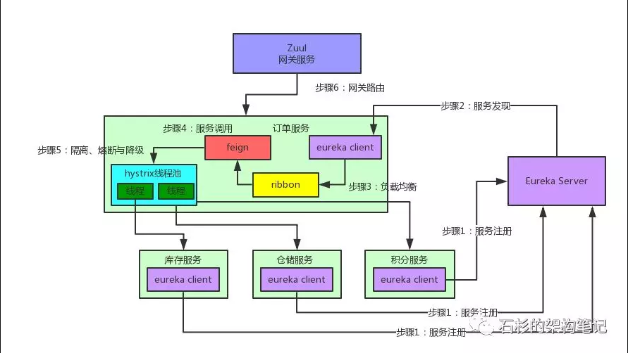

#### Eureka
- Eureka Client：负责将这个服务的信息注册到Eureka Server中
- Eureka Server：注册中心，里面有一个注册表，保存了各个服务所在的机器和端口号

#### Feign
- Feign的一个关键机制就是使用了动态代理
- 首先，如果你对某个接口定义了@FeignClient注解，Feign就会针对这个接口创建一个动态代理

- 接着你要是调用那个接口，本质就是会调用 Feign创建的动态代理，这是核心中的核心

- Feign的动态代理会根据你在接口上的@RequestMapping等注解，来动态构造出你要请求的服务的地址

- 最后针对这个地址，发起请求、解析响应

#### Ribbon
- 它的作用是负载均衡，会帮你在每次请求时选择一台机器，均匀的把请求分发到各个机器上
- Ribbon是和Feign以及Eureka紧密协作，完成工作的，具体如下：

首先Ribbon会从 Eureka Client里获取到对应的服务注册表，也就知道了所有的服务都部署在了哪些机器上，在监听哪些端口号。

然后Ribbon就可以使用默认的Round Robin算法，从中选择一台机器

Feign就会针对这台机器，构造并发起请求。

#### Hystrix
- Hystrix是隔离、熔断以及降级的一个框架。

##### 总结
- Eureka：各个服务启动时，Eureka Client都会将服务注册到Eureka Server，并且Eureka Client还可以反过来从Eureka Server拉取注册表，从而知道其他服务在哪里

- Ribbon：服务间发起请求的时候，基于Ribbon做负载均衡，从一个服务的多台机器中选择一台

- Feign：基于Feign的动态代理机制，根据注解和选择的机器，拼接请求URL地址，发起请求

- Hystrix：发起请求是通过Hystrix的线程池来走的，不同的服务走不同的线程池，实现了不同服务调用的隔离，避免了服务雪崩的问题

- Zuul：如果前端、移动端要调用后端系统，统一从Zuul网关进入，由Zuul网关转发请求给对应的服务

>`服务降级`
   在高并发情况下，防止用户一直等待，使用服务降级方式(直接返回一个友好的提示给客户端，调用fallBack方法)

>`服务熔断`
    熔断机制目的为了保护服务，在高并发的情况下，如果请求达到一定极限(可以自己设置阔值)如果流量超出了设置阈值，
    让后直接拒绝访问，保护当前服务。使用服务降级方式返回一个友好提示，服务熔断和服务降级一起使用

>`服务隔离`
因为默认情况下，只有一个线程池会维护所有的服务接口，如果大量的请求访问同一个接口，达到tomcat 线程池默认
极限，可能会导致其他服务无法访问。解决服务雪崩效应:使用服务隔离机制(线程池方式和信号量)，使用线程池方式
实現隔离的原理:  相当于每个接口(服务)都有自己独立的线程池，因为每个线程池互不影响，这样的话就可以解决服务雪崩效应。

>>`线程池隔离`:
每个服务接口，都有自己独立的线程池，每个线程池互不影响。

>>`信号量隔离`:
使用一个原子计数器（或信号量）来记录当前有多少个线程在运行，当请求进来时先判断计数器的数值，若超过设置的最大线程
个数则拒绝该请求，若不超过则通行，这时候计数器+1，请求返 回成功后计数器-1。
