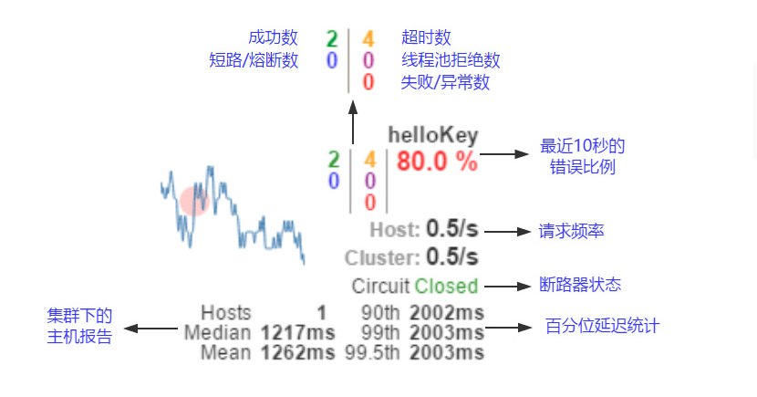

#### 第三章
引入maven依赖应该引入
```$xml
        <dependency>
            <groupId>org.springframework.cloud</groupId>
            <artifactId>spring-cloud-starter-openfeign</artifactId>
        </dependency>
```
---
### 第七章
maven依赖冲突，父pom文件尽量少引用依赖，除非是公用的依赖。。。。

---
### 第十章
**Failed opening connection to http://localhost:3334/hystrix.stream?delay=2000 : 404 : HTTP/1.1 404 **

[Hystrix仪表盘踩坑](https://blog.csdn.net/WYA1993/article/details/82419131)



•实心圆：它有颜色和大小之分，分别代表实例的监控程度和流量大小。如上图所示，它的健康度从绿色、黄色、橙色、红色递减。通过该实心圆的展示，
        我们就可以在大量的实例中快速的发现故障实例和高压力实例。

•曲线：用来记录 2 分钟内流量的相对变化，我们可以通过它来观察到流量的上升和下降趋势。

•其他一些数量指标如下图所示
